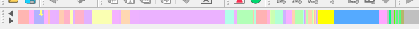
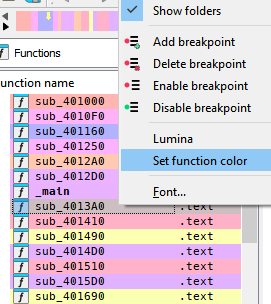

# Navcolor Plugin

The Navcolor plugin is a tool for IDA Pro that enhances the functionality of the navigation band by displaying the color of the function. This allows you to easily identify functions and navigate through the disassembly.



It also provides additional features such as the ability to choose the color of a function through a context menu item in the `Functions` window.



## Installation

To install the Navcolor plugin, follow these steps:

1. Copy the `navcolor64.(dll|dylib)` file to the IDA plugins folder.
2. Launch IDA Pro.
3. Navigate to the `Edit/Plugins` menu.
4. Select the `Show function color in navigation band` option to toggle the plugin on or off. The plugin is on by default.

## Building the Plugin

To build the Navcolor plugin, you will need to use the [ida-cmake](https://github.com/allthingsida/ida-cmake) build system.

Please refer to the ida-cmake documentation for instructions on how to set up and use the build system.

Note: The Navcolor plugin is compatible with IDA Pro 9.0. While it has been tested with this version, it might be possible to use it with previous versions of IDA Pro. 


## Quick demo
To see it in action, you can run the following code to colorize the functions in the current IDB:
```python
import idaapi
import colorsys
from zlib import crc32

rgb_to_int = lambda r, g, b: (r << 16) | (g << 8) | b

qty = idaapi.get_func_qty()
for idx in range(qty):
    fnc: idaapi.func_t =  idaapi.getn_func(idx)
    
    crc =  crc32(idaapi.get_func_name(fnc.start_ea).encode())
    color_idx = crc / 2**32
    color = colorsys.hsv_to_rgb(color_idx, 0.3, 1)
    fnc.color = rgb_to_int([int(255 * c) for c in color])
    
    idaapi.update_func(fnc)
```
